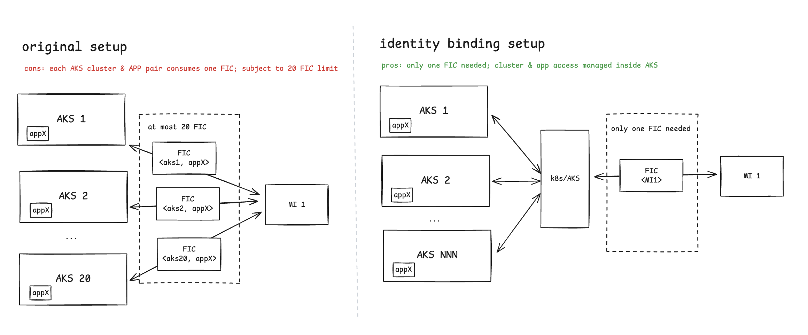

# Pod Identity Migrations

## Overview

AKS pod identity is a deprecated solution for acquiring Entra access token via Azure VM host's IMDS endpoint.
It works by

1) leveraging AKS control plane to assign the user-assigned managed identity (UAMI) to the underlying VMSS node;
2) running a DaemonSet (NMI) on each node to intercept token requests from pods and fetch tokens from IMDS endpoint based on the in-cluster configuration.

This approach has several limitations:

- The NMI proxy supports only Linux nodes.
- The access control is coarse-grained, as the UAMI is assigned at the node level. If NMI is down or misconfigured,
  any pod on the node can potentially access the UAMI.

To migrate away from AKS pod identity, there are usually two scenarios via Workload Identity:

1. Update the application to leverage Azure SDKs to use the `WorkloadIdentityCredential` for automatic token acquisition within the pod.
   This approach requires code changes but provides a seamless experience for token acquisition.
2. If direct code changes are not feasible (e.g., using third-party applications), workload identity proxy can be used to acting as
   a local IMDS endpoint within the pod (by overriding the iptables rules). The actual token acquisition is done via the sidecar container.
   This approach requires minimal code changes, however, the additional sidecar container introduces overhead on resource consumption and maintenance.


## Overcoming 20 FIC Limit

On the other side, Azure Entra sets a limit of 20 federated identity credentials (FICs) per UAMI. This could be a bottleneck if
your usage requires sharing UAMI across multiple AKS clusters.

Identity binding can be used to overcome this limit by moving the workload to service account relationship from UAMI to
AKS managed clusters sub resource. The below diagram illustrates the high level differences:




*Please note that identity binding is currently in private preview and is subject to change.*

## Proxy Migration Approach

### Prerequisites

Before using the proxy, ensure that the target cluster has been enabled with AKS managed workload identity feature.
If you want to enable identity binding flow, please also ensure the cluster has been onboarded.

To verify the cluster is enabled with AKS managed workload identity, you can run the following command:

```bash
$ az aks show --resource-group <rg-name> --name <cluster-name> --query "securityProfile.workloadIdentity.enabled"
true # indicates enabled
```

To verify the cluster has been onboarded for identity binding, you can run the following command:

```bash
$ kubectl -n kube-system get deployments azure-wi-webhook-controller-manager -o jsonpath='{.spec.template.spec.containers[].image}'
mcr.microsoft.com/oss/v2/azure/workload-identity/webhook:v1.6.0-alpha.1
```

If you are not seeing the image with tag `v1.6.0-alpha.1` or above, please contact Azure support.

### Setting up the service account

In workload identity, each application pod will be associated with a Kubernetes service account.
Then the projected service account token will be used to exchange the Entra access token.

The service account needs to be annotated with the client ID of the UAMI.

```diff
apiVersion: v1
kind: ServiceAccount
metadata:
  name: my-sa
  namespace: my-namespace
  annotations:
+    azure.workload.identity/client-id: "${UAMI_CLIENT_ID}" # Replace with actual client ID
```

This annotation tells the webhook to setup the pod environment to use the specified UAMI.

*If you are using identity binding, extra steps will be needed to associate the service account and the UAMI. Please refer to identity binding onboard doc for details.*

### Updating the Deployment

The deployment needs to add the following labels and annotations to the pod template spec for enabling the workload identity flow and proxy:

```diff
apiVersion: apps/v1
kind: Deployment
metadata:
  name: my-deployment
  namespace: my-namespace
spec:
  template:
    metadata:
      labels:
+       azure.workload.identity/use: "true" # This label enables workload identity for the pod
      annotations:
+       azure.workload.identity/proxy: "true" # This annotation enables the workload identity
+       azure.workload.identity/proxy-sidecar-port: "8000" # Set sidecar port (default is 8000)
    spec:
+     serviceAccountName: my-sa # Ensure this matches the service account created earlier
```

If you are using identity binding, an extra annotation is needed to specify the SDK to enable this mode:

```diff
apiVersion: apps/v1
kind: Deployment
metadata:
  name: my-deployment
  namespace: my-namespace
spec:
  template:
    metadata:
      labels:
        azure.workload.identity/use: "true" # This label enables workload identity for the pod
      annotations:
+       azure.workload.identity/use-identity-binding: "true"
        azure.workload.identity/proxy: "true" # This annotation enables the workload identity
        azure.workload.identity/proxy-sidecar-port: "8000" # Set sidecar port (default is 8000)
    spec:
      serviceAccountName: my-sa # Ensure this matches the service account created earlier
```

After updating the deployment, you can redeploy the application to the cluster. There will be an additional sidecar `azwi-proxy` container injected into the pod.
If everything is set up correctly, the application should be able to acquire tokens from the hijacked IMDS endpoint while seeing logs from the sidecar container.

Sample logs from the sidecar container:

```
{"level":"info","timestamp":"2025-10-06T21:53:35.687864Z","logger":"proxy","caller":"/build/top/BUILD/azure-workload-identity/pkg/proxy/proxy.go:117$proxy.(*proxy).msiHandler","message":"received token request","method":"GET","uri":"/metadata/identity/oauth2/token?api-version=2018-02-01&client_id=<redacted>&resource=<redacted>"}
{"level":"info","timestamp":"2025-10-06T21:53:35.850460Z","logger":"proxy","caller":"/build/top/BUILD/azure-workload-identity/pkg/proxy/proxy.go:151$proxy.(*proxy).msiHandler","message":"successfully acquired token","method":"GET","uri":"/metadata/identity/oauth2/token?api-version=2018-02-01&client_id=<redacted>&resource=<redacted>","status":200}
```

### Using more than one UAMIs inside the pod

In pod identity, it's common to use multiple UAMIs within the same pod. In this case, the application code can still work as long as

1) each UAMI has been properly configured with FICs (either using cluster's OIDC issuer or identity binding);
2) the application code explicitly specifies the client ID when requesting tokens.

The proxy sidecar will still intercept the token requests and exchange the tokens accordingly. For deployment sample, please refer to:

- [workload identity proxy](/apps/demo-app-wi-proxy/)
- [identity binding proxy](/apps/demo-app-ib-proxy/)
